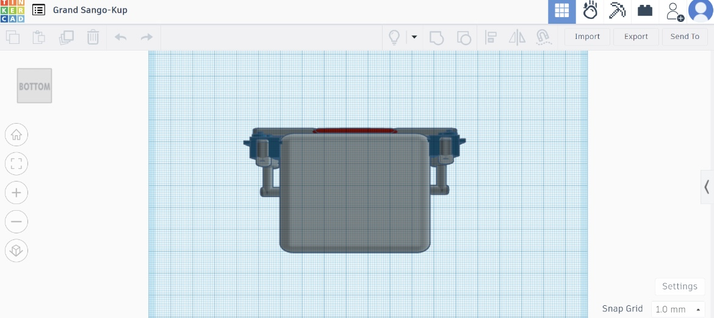

# Robot-Mouth-Servo-Design

In this project, we aim to design a robot face with a movable mouth using four servo motors. The servos are placed on the sides of the mouth to simulate realistic talking motions.

### Materials Used
- Tinkercad for 3D design
- 4 servo motors (2 for each side of the mouth)
- Rubber wires for mouth movement

### Design Process
1. **Creating the Face Structure:**: 
    - Open Tinkercad and start a new 3D design project.
    - Design the basic structure of a leg with joints at the pelvis, knee, and foot.

2. **Adding Servo Motors:**: 
    - Place two servo motors on the right side of the mouth.
    - Place two servo motors on the left side of the mouth.
    - Ensure the servos are fixed properly to prevent movement of the face structure.

3. **Connecting the Servos:**:
    - Attach rubber wires to the servo motors.
    - Connect the rubber wires in front of the face to form the mouth.
    - Ensure the alignment allows for smooth movement to simulate talking.

### Photos
1. **Front View**
    
2. **Right View**
    
3. **Left View**
    
4. **Back View**
    
5. **Top View**
    
6. **Bottom View**
    

   ### 3D Design Link
[Click here to view the 3D design on Tinkercad](https://www.tinkercad.com/things/eWTTN1NAbas-grand-sango-kup/edit?sharecode=LdCIvQDC7kWbmXAby5lmGuiPfd1-RtzggKtmHHpZQ14)
